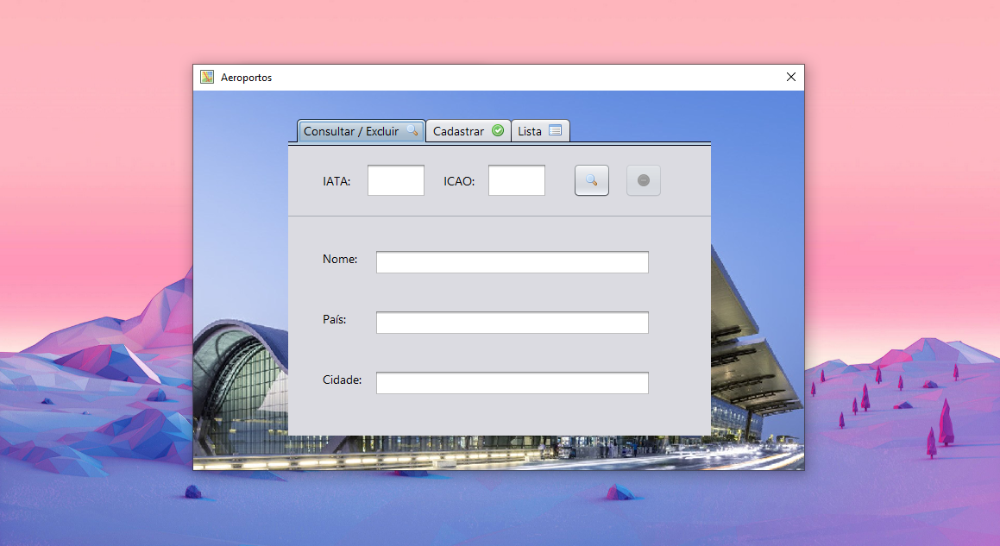

# JAVA-Air-Traffic-Control
> Application developed using java. It was made for Data Structures I subject.

  

## About
Linked list implementation to link airports to their respective flights. This project presents:

1. JAVA Form front-end;
2. Registering of airports;
3. Registering of flights in their respective airports;
4. Deleting of both flights and airports;
5. Listing of both flights and airports.
6. Project developed for COTUCA data structures subject project.

## Meta

Made by Eduardo Migueis, Manuela Benassi and Rodrigo Smith

Distributed under the MIT License. See `LICENSE` for more information.

Copyright (c) 2020.